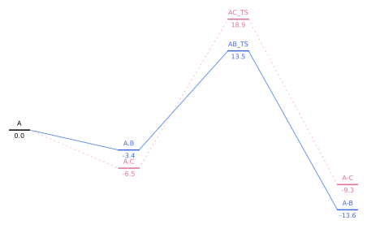

# Energy Diagram Plotter

A Python script to generate energy diagrams from Excel data. This tool visualizes states, their energies, and connections between them, producing a clean diagram.

---

## Features

- **State Visualization**: Plot energy levels as horizontal bars with customizable colors.
- **Connections**: Draw connections between states with customizable line styles (solid, dashed, dotted) and colors.
- **Automatic Layout**: Adjusts the horizontal position of states that are too close vertically to avoid overlap.
- **Customizable Output**: Control figure size, bar width, label offsets, and more via command-line arguments.
- **Export**: SVG output by default, though .eps, .pdf, .png, etc. should work too.
---

## Requirements

- Python 3.12 (might work on other versions)
- Required libraries:
  - `pandas`
  - `matplotlib`
  - `openpyxl` (for Excel file support)

Install the dependencies using:

```bash
pip install pandas matplotlib openpyxl
```

---

## Usage

### Command Line

Run the script from the command line with the following arguments:

```bash
python energy_diagram.py [options]
```

#### Arguments


| Argument          | Default              | Description                                                                              |
| ----------------- | -------------------- | ---------------------------------------------------------------------------------------- |
| `-f, --file`        | `data.xlsx`          | Excel file containing the state data.                                                    |
| `--width`           | `16`                 | Figure width in centimeters.                                                             |
| `--height`          | `10`                 | Figure height in centimeters.                                                            |
| `-b, --bar_width`   | `1`                  | Width of the energy bars in centimeters.                                                 |
| `-o, --offset`      | `0.5`                | Vertical offset between the bar and its labels.                                          |
| `-e, --threshold`   | `1`                  | Energy difference threshold below which states are considered "too close". |
| `-s, --fontsize`    | `8`                  | Font size for labels.                                                                    |
| `-d, --distance`    | `0.2`                | Horizontal offset for states that are too close.                                         |
| `--output`          | `energy_diagram.svg` | Output file name.                                                                        |


#### Example

```bash
python energy_diagram.py -f my_data.xlsx --width 20 --height 12 --output my_diagram.svg
```

---

## Excel File Format

The input Excel file must contain the following columns:


| Column        | Type    | Required | Description                                                  |
| ------------- | ------- | -------- | ------------------------------------------------------------ |
| `ID`          | str/int | Yes      | Unique identifier for the state.                             |
| `State`       | str     | Yes      | Label for the state (displayed above the bar).               |
| `Energy`      | float   | Yes      | Energy value in kcal/mol.                                    |
| `X`           | float   | Yes      | X-position of the bar in the diagram.                        |
| `Connects to` | str     | Yes      | Comma- or semicolon-separated list of connection specifiers. |
| `Color`       | str     | No       | Color of the state bar (default: `black`).                   |


### Connection Specifiers

Connections between states are defined in the `Connects to` column using the following syntax:

- **Basic**: `2` → Connects to state with ID `2` (solid line, default color).
- **Dashed Line**: `2--` → Connects to state `2` with a dashed line.
- **Dotted Line**: `2.` → Connects to state `2` with a dotted line.
- **Custom Color**: `2blue` or `2-blue` → Connects to state `2` with a solid blue line.
- **Custom Color + Line Style**: `3.#454534` → Connects to state `3` with a dotted line and color `#454534`.

---

## Output

The script generates an picture with the following features:

- **No Axes**: The diagram is clean, with no ticks, labels, or borders.
- **State Bars**: Horizontal bars representing energy levels, colored as specified.
- **Energy Labels**: Displayed below each bar.
- **State Labels**: Displayed above each bar (if provided).
- **Connections**: Lines connecting states, with customizable styles and colors.

---

## Example Data

Here is an example of what your Excel file might look like:


| ID  | State | Energy | X   | Connects to    | Color |
| --- | ----- | ------ | --- | -------------- | ----- |
| 1   | A     |   0.0  | 1   | 2-blue,5--pink | black |
| 2   | A.B   | - 3.4  | 2   | 3-blue         | blue  |
| 3   | AB_TS |  13.5  | 3   | 4-blue         | blue  |
| 4   | A-B   | -13.6  | 4   |                | blue  |
| 5   | A.C   | - 6.5  | 2   | 6--pink        | pink |
| 6   | AC_TS |  18.9  | 3   | 7--pink        | pink |
| 7   | A-C   | - 9.3  | 4   |                | pink |



